# Model Selection

## Overview

OpenCode dispatches subagents through the `task` tool. The `task` tool does
not accept a `model` argument; the model that runs the subagent is the
default model in effect at the time of the dispatch. This skill explains
how to choose what to put in the subagent's frontmatter so the model
selection actually persists across the consumer's repo and team.

## When to encode model selection

- Encode a `model:` line in the subagent's frontmatter when the subagent
  must always run on a specific model (because the review/verifier contract
  pins it, or because the agent is wired into the Ready gate).
- Leave the `model:` line out when the subagent is a methodology helper
  (TDD, debugging, subagent driven development). Inheriting the consumer's
  default keeps the build-model promotion gate meaningful and avoids
  treating the model as a secret knob.

## When to leave the model implicit

- Practice subagents (TDD, debugging, subagent-driven development, model
  selection) do not need a `model:` pin. They are methodology helpers.
  Pinning them would make their content effectively a model-driven
  personality rather than a transportable workflow.
- The Leo delivery evaluator and the opencode-ship verifier do need a
  pin because the canonical review contract requires every consumer to
  ship the same shape, and `MiniMax-M3` is the OpenCode baseline that
  every consumer inherits.

## When to invoke this skill

- Before merging a new subagent into `.opencode/agents/`.
- During the bake-off cycles that re-evaluate the verifier and the
  reviewer. The pinned `model:` line is the only thing that survives a
  consumer upgrade.

## Decision flows

```dot
digraph model_selection {
    "Need a stable contract?" [shape=diamond];
    "Practice methodology helper?" [shape=diamond];
    "Pin model: line in frontmatter" [shape=box, style=filled, fillcolor="#ccffcc"];
    "Leave model inheritance to the consumer" [shape=box, style=filled, fillcolor="#ccccff"];
    "Stable contract + methodology" [shape=diamond];
    "Pin model: line; cite the Ready gate in the description" [shape=box, style=filled, fillcolor="#ffcccc"];
    "Stable contract?" [shape=diamond];
    "Update only via the canonical upgrade path" [shape=box, style=filled, fillcolor="#ffccff"];
}
```

## Reminders

- Never add a `model:` pin to a methodology helper that is meant to be
  shared across consumers.
- The `task` tool does not let the parent override the model, so any
  per-dispatch model override has to be expressed ahead of time in the
  agent file or the consumer's `opencode.json`.
- When in doubt, leave the model implicit and document the choice in the
  skill or the description frontmatter.
